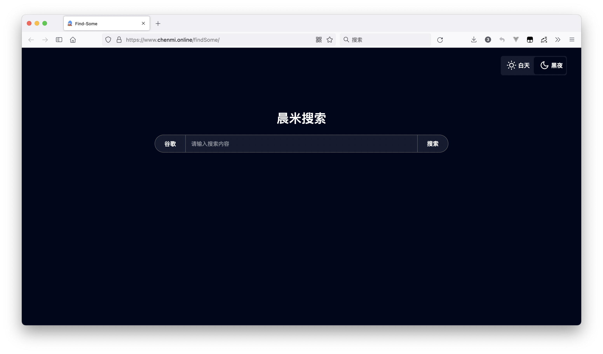

# 个人自制的搜索页面

## 采用以下几种制作

目前项目部署使用的原生制作的网页

1. 原生制作
[代码在 nativeJs 分支查看](https://github.com/Your-songs-are-so-good/findSome/tree/nativeJs)
2. webpack + vue 模版制作
[代码在 vue@3 分支查看](https://github.com/Your-songs-are-so-good/findSome/tree/vue%403)
3. 更多
正在抓紧制作

## 学习日志

2022-06-23 初步使用 webpack + vue@3 搭建框架，将仓库分支进行规划
